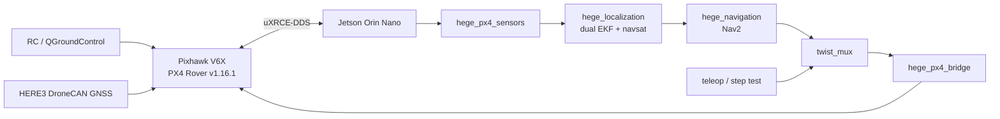

# GPS based Navigation for Hege Robot

GPS waypoint navigation for the Hege Ackermann field robot, developed for the
Erasmus BIP Robotics Bootcamp 2026.

The goal is a navigation stack that is developed and validated entirely in
simulation, independent of the target hardware, and then deployed onto the real
robot with GPS as the only localization source.

The repository holds two halves that meet at the Pixhawk:

- a **navigation stack** — a measured URDF model, a Gazebo simulation, dual-EKF
  localization from GPS and IMU, and Nav2 tuned for a car-like base that cannot
  turn on the spot;
- a **PX4 integration** — a ROS-to-PX4 offboard bridge with its own safety
  supervisor, PX4-to-ROS sensor conversion, command arbitration, and a Gazebo
  model that lets PX4 SITL drive this specific vehicle.

## System architecture



Responsibilities are split on purpose. The **Pixhawk** owns state estimation,
rover control and the actuators. The **Jetson** owns the bridge, command
arbitration, standard sensor topics and everything above them. A **workstation**
runs RViz, the simulation and QGroundControl.

## Status

Being precise about this, because a stack that looks finished and is not costs
a day in the field.

| | Status |
|---|---|
| Measured Hege URDF and TF tree | Working |
| Gazebo Classic simulation, Ackermann controller | Working |
| Dual-EKF + `navsat_transform` localization | Working, ~0.08 m against ground truth |
| Nav2 GPS waypoint following | Working, full mission driven end to end |
| Bridge and sensor conversion unit tests | 141 passing |
| Jetson–Pixhawk ROS 2 topic link | Working *(verified on hardware by Oğuzhan)* |
| PX4 offboard heartbeat at 20 Hz | Working *(same)* |
| ROS GPS, IMU and odometry conversion | Working *(same)* |
| HERE3 correction path, RTK Float outdoors | Working *(same)* |
| Gazebo Harmonic port of the simulation | **Written, never run** |
| PX4 SITL driving the Hege model | **Written, never run** |
| Nav2 driving the real rover through PX4 | **Not attempted** |

The last three are the honest edge of this project. `docs/px4_sitl.md` and
`docs/gazebo_harmonic.md` each end with a section saying exactly what was and
was not verified, and what to suspect first.

## Vehicle parameters

Taken from `src/hege_description/urdf/hege.urdf.xacro`, which is the single
source of truth — the PX4 airframe and the Gazebo model are both generated or
derived from it.

| Parameter | Value |
|---|---:|
| Steering geometry | Ackermann, rear-wheel drive |
| Wheelbase | 1.90 m |
| Front track | 1.55 m |
| Rear track | 1.55 m |
| Front wheel radius | 0.28 m |
| Rear wheel radius | 0.40 m |
| Maximum steering angle | 0.611 rad (35°) |
| Total mass | 1300 kg |
| Front axle load share | 40 % |
| `base_link` height | 1.10 m |
| IMU height | 1.20 m |
| GNSS antenna height | 1.30 m |

Minimum turning radius from the bicycle model:

```text
R_min = L / tan(delta_max) = 1.90 / tan(0.611) = 2.71 m
```

Nav2 is held to **6.0 m** rather than 2.71, because that is what the rover was
measured to actually achieve — the geometric minimum assumes no tyre slip.

### Reconciled with oguzissik

These numbers used to differ from
[oguzissik/hege_gps_navigation](https://github.com/oguzissik/hege_gps_navigation),
where the PX4 packages came from — rear track, front wheel radius, steering
limit and 100 kg of mass. Both sets were described as measured. The values
above are now that repository's `VERIFIED MEASUREMENTS` block, adopted
wholesale, so the two agree.

Two things left over from the reconciliation:

- oguzissik's own repository carries **1.90 m** in its xacro and **1.91 m** in
  `bridge_real.yaml`, and its README says "1.90–1.91 m". This repository uses
  1.90 everywhere, from the xacro. It changes the turning radius by under a
  centimetre, but the number should be settled rather than left as a range.
- The wheel and knuckle masses are still ours (80/45/15 kg). They are estimates
  in both repositories, not measurements, and ours were tuned for solver
  stability — a large mass ratio across a joint makes ODE diverge. Only the
  1300 kg total is measured, and the chassis absorbs the difference.

The measured turning radii in `nav2_params.yaml` — 4.20 m at 0.6 m/s, 4.64 at
1.0, 5.44 at 1.5 — were taken **before** this change and have not been
re-measured. The geometric minimum moved from 2.79 m to 2.71 m; the achievable
one may have moved too.

## Packages

| Package | What it is |
| --- | --- |
| `hege_description` | URDF/Xacro model, Gazebo worlds, Ackermann controller, `/cmd_vel` relay |
| `hege_localization` | Dual-EKF + `navsat_transform` state estimation |
| `hege_navigation` | Nav2 configuration, Ackermann behaviour trees, GPS waypoint follower |
| `hege_px4_bridge` | `/cmd_vel` → PX4 offboard velocity setpoints, with a safety supervisor |
| `hege_px4_sensors` | PX4 NED/FRD topics → standard ROS `Odometry`, `Imu`, `NavSatFix` |
| `hege_bringup` | `twist_mux` arbitration and the real/SITL launch files |
| `hege_px4_sim` | The Hege Gazebo model and PX4 airframe for SITL |

`hege_px4_bridge`, `hege_px4_sensors` and `hege_bringup` were written by
Oğuzhan Enes Işık against the real Pixhawk and PX4 SITL in
[oguzissik/hege_gps_navigation](https://github.com/oguzissik/hege_gps_navigation)
and brought in from there.

## Running the simulation

```bash
ros2 launch hege_description spawn_hege.launch.py
ros2 launch hege_localization localization.launch.py
ros2 launch hege_navigation navigation.launch.py rviz:=true

ros2 run hege_navigation gps_waypoint_follower.py --ros-args \
  -p waypoints_file:=install/hege_navigation/share/hege_navigation/config/waypoints_short_run.yaml
```

This is Gazebo **Classic**, and it is where the tuning was measured.

`spawn_hege_gz.launch.py` is the same simulation on Gazebo **Harmonic**. It
exists because PX4 SITL requires Harmonic and the two Gazebo generations cannot
be installed on the same machine — their packages both ship `/usr/bin/gz` and
conflict outright. `docs/gazebo_harmonic.md` covers that port and what to
install.

`hege.urdf.xacro` serves all of it through its `drive` argument: `planar` and
`ros2_control` on Classic, `gz` and `px4` on Harmonic.

## Running PX4 SITL

On a machine with Gazebo Harmonic and a PX4 v1.16.1 checkout:

```bash
cd src/hege_px4_sim
./scripts/generate_hege_model.sh              # xacro -> model.sdf
./scripts/install_to_px4.sh <PX4-Autopilot>   # model + airframe into PX4

cd <PX4-Autopilot> && make px4_sitl gz_hege_rover
ros2 launch hege_bringup hege_sitl.launch.py rviz:=true
```

Nothing moves until PX4 is armed and in offboard mode. In SITL the bridge's own
services do it:

```bash
ros2 service call /hege/bridge/set_offboard std_srvs/srv/Trigger
ros2 service call /hege/bridge/arm std_srvs/srv/Trigger
```

## The real rover

Tested topology:

```text
Workstation / QGroundControl
        |  Wi-Fi / LAN
Jetson Orin Nano (ROS 2 Humble)
        |  UART / Ethernet
Pixhawk V6X (PX4 Rover v1.16.1)
        |  DroneCAN CAN1
HERE3 GNSS
```

| Interface | Value |
|---|---|
| ROS domain | `73` |
| UART baud rate | `921600` |
| Micro XRCE-DDS UDP port | `8888` |
| GNSS bus | DroneCAN CAN1 |

TELEM2 stays on MAVLink for QGroundControl; uXRCE-DDS uses Ethernet UDP 8888.
Never reassign TELEM2 to DDS.

On the Jetson, with the agent already running:

```bash
export ROS_DOMAIN_ID=73
ros2 launch hege_bringup real.launch.py start_agent:=false
```

Checks from a second sourced terminal:

```bash
ros2 topic hz /fmu/out/vehicle_attitude       # about 100 Hz
ros2 topic hz /fmu/in/offboard_control_mode   # about 20 Hz
ros2 topic echo /fmu/out/vehicle_gps_position --once
ros2 topic echo /hege/bridge/status --once
```

Note that `real.launch.py` starts the agent, `twist_mux`, the bridge and the
sensor conversion — **not** localization or Nav2. There is no real-vehicle
autonomous launch yet; `hege_sitl.launch.py` shows the combination it would
need.

## Command arbitration

`twist_mux` picks one source, highest priority wins:

| Topic | Priority | Timeout |
|---|---:|---:|
| `/cmd_vel/teleop` | 100 | 0.25 s |
| `/cmd_vel/test` | 50 | 0.25 s |
| `/cmd_vel/nav` | 10 | 0.50 s |

The selected command appears on `/cmd_vel/selected`, which is the only velocity
topic the bridge reads. Teleop outranks everything, which is how a human takes
the vehicle back. The bridge publishes neutral once the selected input goes
stale.

## Bridge status and services

```bash
ros2 topic echo /hege/bridge/status --once
```

The state is the first failing check, in order of severity: `SOFTWARE_STOP`,
`WAITING_PX4`, `PX4_STALE`, `NOT_OFFBOARD`, `CMD_TIMEOUT`, `ACTIVE`.

```text
/hege/bridge/arm            /hege/bridge/disarm
/hege/bridge/set_offboard   /hege/bridge/clear_software_stop
```

On the real vehicle `bridge_real.yaml` ships `allow_remote_vehicle_commands:
false`, so arming and mode changes stay with RC and QGroundControl. The services
are for a supervised acceptance test, not routine use.

`bridge_real.yaml` also ships `px4_yaw_p: 0.0`, and the node refuses to start on
that. It is a deliberate gate: the bridge asks PX4 for a yaw rate by offsetting
the heading setpoint by `omega / RO_YAW_P`, and the two only cancel when the
number matches the tuned `RO_YAW_P` on the board. A wrong value turns the rover
at the wrong rate and reports nothing.

## GNSS and RTK

The correction path that was tested:

```text
NTRIP corrections -> Jetson -> MAVLink GPS_RTCM_DATA
                  -> Pixhawk -> DroneCAN -> HERE3
```

Outdoors the HERE3 reached **RTK Float** (`fix_type = 5`) with roughly 0.22 m
horizontal and vertical error. The NTRIP client and its credentials are
deliberately not in this repository.

PX4 fix types: 3 = 3D, 4 = differential, 5 = RTK Float, 6 = RTK Fixed. Useful
from the PX4 MAVLink console:

```text
listener sensor_gps 20
listener gps_inject_data 5
uavcan status
listener estimator_status_flags 5
listener failsafe_flags 5
```

Worth knowing: the simulated GPS in `hege.urdf.xacro` defaults to 0.02 m noise,
which is RTK **Fixed**. The best achieved on hardware so far is Float at 0.22 m,
so the simulation is currently more optimistic than the real receiver. Raise
`gps_noise` to 0.4 to see what the localization does under the fix actually
available.

## Safety

The vehicle is well over a tonne and has **no lidar, radar or depth camera**.
This software cannot detect or avoid a person, an animal or an obstacle, and
nothing in it will stop for one. It is open-ground navigation, not obstacle
avoidance.

The software stop is a ROS-level latch. It is not a substitute for the physical
emergency stop.

Before any motion test:

1. Keep the rover disarmed until every check passes.
2. Driven wheels lifted, or a cleared and controlled area.
3. Physical emergency stop and RC takeover ready, in someone's hands.
4. Confirm the bridge reports a neutral command.
5. Confirm PX4's local velocity and heading estimates are valid.
6. Start at the configured 0.3 m/s limit.
7. Disarm before stopping any bridge process.

## Troubleshooting

**`px4_msgs` message type is invalid.** Re-source the overlays and restart
discovery — and check that `px4_msgs` matches the firmware, because a version
mismatch shows up as topics that exist and never deliver:

```bash
ros2 daemon stop && ros2 daemon start
ros2 interface show px4_msgs/msg/SensorGps
```

**No `/fmu/out/*` topics at all.** Almost always `ROS_DOMAIN_ID`. The real robot
is domain 73; with the default 0 the list comes back empty and it looks like the
bridge is down. The daemon caches discovery per domain, so restart it after
changing.

**`Address already in use` from Gazebo.** A previous `gzserver` survived its
`Ctrl+C`. `pkill -9 -f "gzserver|gzclient"`, then relaunch. Symptoms of the
stale process are `Entity [hege] already exists` and `Controller already
loaded`.

**Controller manager unavailable.** On Harmonic, `gz_ros2_control`'s workspace
has to be sourced and its `lib` has to be on `GZ_SIM_SYSTEM_PLUGIN_PATH`;
`spawn_hege_gz.launch.py` sets the path itself but cannot source the workspace
for you. Gazebo will start and the model will appear either way — the failure is
silent until a spawner times out.

**Duplicate package names.** Only one copy of each package may be in the
workspace:

```bash
find src -name package.xml -print0 | xargs -0 grep -h '<name>' | sort | uniq -d
```

## Docs

| | |
|---|---|
| `docs/px4_ros2_topics.md` | The ROS 2 interface the Pixhawk actually exposes, captured from the real robot, and what it means for the navigation stack |
| `docs/px4_bridge.md` | How a `Twist` becomes an offboard setpoint, what the safety supervisor does, and the five things to settle before Nav2 drives the real rover |
| `docs/px4_sitl.md` | Joining the two simulations: the model generated from the xacro, the names PX4 hardcodes, and what has and has not been verified |
| `docs/gazebo_harmonic.md` | The Harmonic port: why the two Gazebos cannot coexist, what changed, and what to install |

## External dependencies

`EXTERNAL_DEPS.txt` pins the revisions the PX4 packages were developed against.
`px4_msgs` and `PX4-Autopilot` are cloned into the workspace rather than
vendored, and both are in `.gitignore`:

```bash
git clone --branch release/1.16 https://github.com/PX4/px4_msgs.git src/px4_msgs
git -C src/px4_msgs checkout 392e831
```

## Helper scripts

`scripts/collect_interface_inventory.sh` captures the node, topic, service and
action inventory of a running system — it is how the tables in
`docs/px4_ros2_topics.md` were produced. `scripts/record_discovery_bag.sh`
records every discovered topic to an mcap bag. Both write under `data/`, which
is ignored.

## Credits

The PX4 bridge, the sensor conversion and the command arbitration are the work
of Oğuzhan Enes Işık, developed and hardware-tested in
[oguzissik/hege_gps_navigation](https://github.com/oguzissik/hege_gps_navigation).
The RTK, connection and troubleshooting notes above come from that work too.
